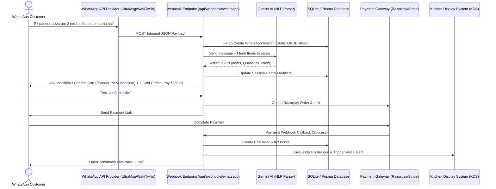

# 💬 WhatsApp AI Chatbot Ordering: Step-by-Step Implementation Plan

Yeh guide aapko batayegi ki **OrderMint** ke liye ek advanced AI-powered WhatsApp Chatbot kaise step-by-step develop karna hai, jo customer ke text orders (Hinglish/English) ko automatically parse karke kitchen (KDS) tak pahunchaye.

---

## 🏗️ 1. Architecture Flow Diagram



---

## 📂 2. Step-by-Step Task Checklist

### Step 1: Database Schema Modifications (Prisma)
Hamein customer ki conversational state aur temporary cart ko save karne ke liye database schema me update karna hoga. 

1. [prisma/schema.prisma](file:///Users/ritchie/Desktop/live%20website%20/posendwebsite/prisma/schema.prisma) file me yeh **WhatsAppSession** model add karna hoga:
   ```prisma
   model WhatsAppSession {
     id            String   @id @default(cuid())
     phone         String   @unique                  // Customer's WhatsApp Number
     state         String   @default("GREETING")     // GREETING, ORDERING, CONFIRMING, AWAITING_PAYMENT
     cart          String   @default("[]")           // Temporary cart items stored as JSON String
     metadata      String?                           // Modifiers, Address, Name, Table ID
     createdAt     DateTime @default(now())
     updatedAt     DateTime @updatedAt
   }
   ```
2. Database migration run karni hogi:
   ```bash
   npx prisma migrate dev --name add_whatsapp_session
   ```

---

### Step 2: Set up Inbound Webhook Endpoint
Hamein WhatsApp API provider (e.g., UltraMsg, Wati, ya Twilio) se aane wale messages ko receive karne ke liye API route banana hoga.

1. **Create File**: `src/app/api/webhooks/whatsapp/route.ts`
2. **Features**:
   * Handle incoming POST requests from the provider.
   * Verify secure signature token to prevent spam.
   * Identify customer phone number and fetch/initiate their session in `WhatsAppSession`.

---

### Step 3: NLP Parser using Gemini AI (Hindi, English & Hinglish Support)
Gemini 3 Flash ko structured prompt dekar message ko JSON format me convert karwana.

*   **Example Input**: *"Suno, ek veg spring roll aur do sweet corn soup add kar do, soup spicy hona chahiye."*
*   **System Prompt for Gemini**:
    ```text
    You are an AI Waiter for OrderMint Restaurant. Analyze the customer message and map it against the provided Menu List.
    Return ONLY a JSON response in this schema:
    {
      "intent": "ADD_TO_CART" | "REMOVE_FROM_CART" | "CLEAR_CART" | "VIEW_CART" | "CHECKOUT" | "GREETING",
      "items": [
        {
          "name": "Veg Spring Roll",
          "quantity": 1,
          "notes": ""
        },
        {
          "name": "Sweet Corn Soup",
          "quantity": 2,
          "notes": "spicy"
        }
      ],
      "language": "Hinglish",
      "needsModifiers": false
    }
    ```

---

### Step 4: Cart and Modifier Flow Logic
Agar customer koi aisi dish order karta hai jiske modifiers baki hain (jaise Pizza Size: *Medium or Large*, Cold Coffee: *With or Without Ice cream*):
*   Bot database se check karega aur selection buttons ya numeric option options list reply karega: 
    *   *"Aapka Pizza kis size me chahiye? 1. Medium, 2. Large"*
*   Session me user ka state `AWAITING_MODIFIERS` par lock hoga aur options receive hote hi cart update ho jayegi.

---

### Step 5: Checkout & Payment Gateway Integration (Razorpay/Stripe)
1. Jab customer bolta hai *"Bill bana do"* ya *"Check out"*:
   * Bot session cart ka totals calculate karega (Subtotal + GST + Discounts).
   * Razorpay API call karke order create karega: `/api/payments/create-link`.
   * User ko link send hogi: *"Aapka bill ₹450 hai. Payment complete karne ke liye is link par click karein: [Razorpay Link]"*.
2. **Payment webhook callback setup**: `src/app/api/webhooks/payments/route.ts` listen karega aur confirm hotay hi database me `PosOrder` aur `KotTicket` status generate karega.

---

### Step 6: Direct Dispatch to KDS (Kitchen Display System)
*   Jaise hi payment confirm hoti hai, orders database me add honge aur KDS panel ([kitchen-display/page.tsx](file:///Users/ritchie/Desktop/live%20website%20/posendwebsite/src/app/%28dashboard%29/kitchen-display/page.tsx)) realtime me use automatically reflect karega.
*   Voice alert call out karegi: *"New Online order received via WhatsApp!"*

---

## 🛠️ 3. Implementation Steps to Start Code Development

### A. Environment Configuration
`.env` file me provider keys aur webhook tokens register karein:
```env
WHATSAPP_INBOUND_TOKEN="your_secure_webhook_token"
ULTRAMSG_API_URL="https://api.ultramsg.com/v1/..."
ULTRAMSG_INSTANCE_ID="instanceXXXX"
RAZORPAY_KEY_ID="rzp_test_..."
RAZORPAY_KEY_SECRET="secret..."
```

### B. Route Handler Setup
Webhook file me incoming structure define karna:
```typescript
// File: src/app/api/webhooks/whatsapp/route.ts
import { NextRequest, NextResponse } from 'next/server';
import { prisma } from '@/lib/prisma';
import { genAI } from '@/lib/gemini'; // Ensure Gemini helper is loaded

export async function POST(req: NextRequest) {
  const body = await req.json();
  const message = body.data?.body; // Structure changes depending on provider (UltraMsg/Wati)
  const senderPhone = body.data?.from;

  if (!message || !senderPhone) {
    return NextResponse.json({ error: 'Missing parameters' }, { status: 400 });
  }

  // 1. Fetch/Create Session
  let session = await prisma.whatsAppSession.findUnique({
    where: { phone: senderPhone }
  });
  if (!session) {
    session = await prisma.whatsAppSession.create({
      data: { phone: senderPhone, state: 'GREETING' }
    });
  }

  // 2. Process conversation state and call Gemini AI NLP Parser
  // 3. Respond back via WhatsApp client API post parsing

  return NextResponse.json({ success: true });
}
```
